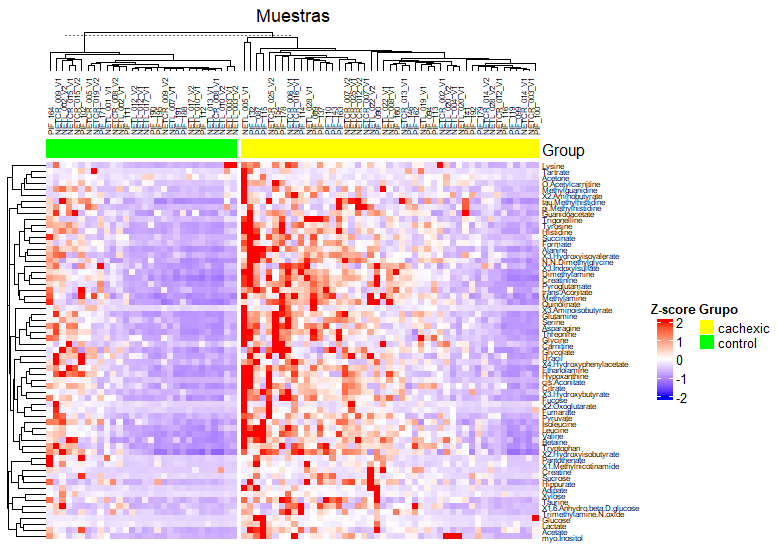
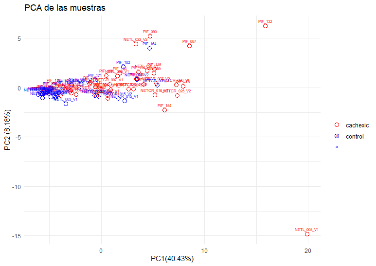
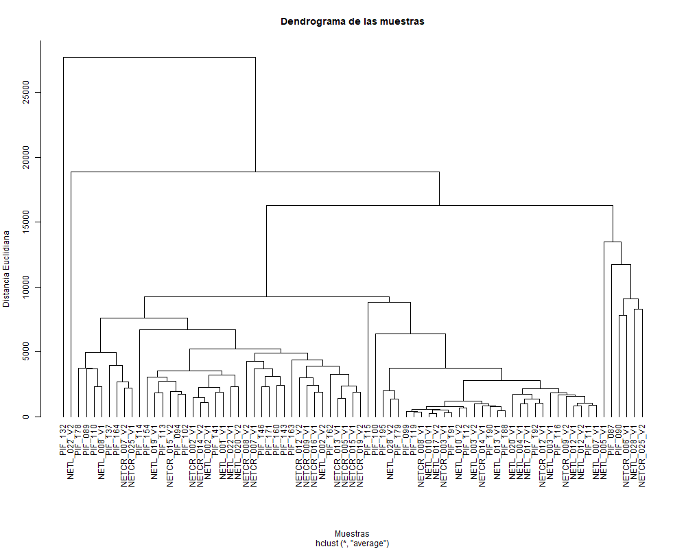
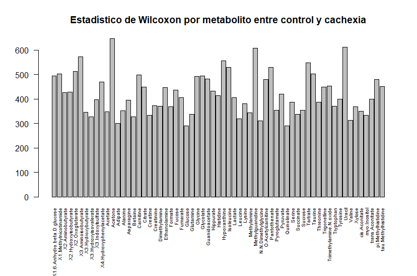

# Introducción

En esta PEC se pondrá en práctica lo aprendido hasta el momento en la asignatura. Se requerirá el uso de GitHub y de distintos paquetes de Bioconductor. Los objetivos de esta práctica son:

-   Seleccionar, descargar y realizar un análisis exploratorio de un dataset.

-   Conocer la clase SummarizedExperiment.

-   Crear un repositorio de GitHub con los archivos indicados en el enunciado de la PEC.

# Métodos

A continuación se expone cómo se ha descargado el dataset y el formateo necesario de los datos para crear el objeto de clase SummarizedExperimment, así como la explicación de esta clase.

## Selección y descarga del dataset

Se ha procedido a la descarga del dataset human_cachexia a partir del repositorio de github aportado por el profesor.

```{r}
url<-"https://raw.githubusercontent.com/nutrimetabolomics/metaboData/refs/heads/main/Datasets/2024-Cachexia/human_cachexia.csv"
dataset<-"human_cachexia.csv"
download.file(url,dataset)
datos<-read.csv(dataset)
colnames(datos)
```

Observemos que las dos primeras columnas son Pacient.ID y Muscle.loss, el resto de columnas corresponden al nivel de expresión de distintos metabolitos. En la creación del objeto de clase SummarizedExperiment deberemos de formatear estos datos para ajustarlo a los requisitos de la clase.

## Clase SummarizedExperiment

La clase SummarizedExperiment permite guardar matrices rectangulares de resultados experimentales normalmente obtenidos mediante experimentos de secuenciacion. La clase garantiza la sincronia entre los meta-data y las observaciones ya que coordina ambos a la hora de crear subconjuntos. SummarizedExperiment es un contenedor tipo matriz donde las filas representan caracteristicas de interés y las columnas son las muestras.

Esta clase es similar en muchos aspectos a la clase ExpressionSet pero, la principal diferencia es que la clase SummarizedExperiment es más flexible en la informacion de las filas.

Para la creación de la clase SummarizedExperiment a partir del dataset human_cachexia.csv se ha formateado el dataset siguiendo los siguientes pasos:

1.  Se da formato de matriz a los datos a excepción de la columna 1 y 2 (Patient.ID y Muscle.loss).

```{r}
suppressMessages(library(SummarizedExperiment))
assayData<-as.matrix(datos[,-c(1:2)])
```

2.  Se transpone la matriz para que las filas sean los metabolitos y las columnas las muestras.

```{r}
assayData<-t(assayData)
```

3.  Se asignan a la matriz los nombres de las filas a los metabolitos.

```{r}
rownames(assayData)<-colnames(datos)[-c(1:2)]
```

4.  Se asignan a la matriz los nombres de las coolumnas a las muestras.

```{r}
colnames(assayData)<-datos$Patient.ID
```

5.  Se crea el DataFrame de Bioconductor para almacenar los metadatos de la columna Muscle.loss.

```{r}
columnData<-DataFrame(Muscle.loss=datos$Muscle.loss)
```

6.  Se asigna como nombre de las filas del DataFrame la columna Patient.ID.

```{r}
rownames(columnData)<-datos$Patient.ID
```

7.  Se crea el objeto SummarizedExperiment (summarized_experiment_cachexia.Rda) siendo el assay la matriz con los datos (datos_cachexia.csv) y colData los metadatos del DataFrame (metadatos_cachexia.csv).

```{r}
se<-SummarizedExperiment(assays=list(counts=assayData), colData=columnData)
```

# Resultados

A continuación se exponen los resultados del análisis exploratorio del dataset en base a lo visto en las actividades de la asginatura.

### Estructura

El objeto se de la clase SummarizedExperiment presenta la siguiente estructura:

|  |  |  |
|------------------|------------------|-----------------------------------|
| clase | SummarizedExperiment | Objeto de la clase SummarizedExperiment, que es utilizada en Bioconductor para almacenar datos ómicos |
| dimensión | 63 77 | 63 es el numero de filas en assayData, filas que corresponden a los metabolitos analizados. 77 es el número de columnas de assayData que corresponden a las muestras. |
| metadata | 0 | Indica que no hay agregada información general a estos datos. |
| assays | 1 counts | Nos indica que el objeto contiene una matriz de datos llamada counts. |
| rownames | Glucose ... | Muestras los nombres de las 63 filas, los nombres corresponden a los metabolitos. |
| rowData | 0 | Indica que no hay información extra sobre los metabolitos. |
| colnames | PIF_178 ... | Muestra los nombres de las 77 columnas, corresponden a los ID de los pacientes. |
| colData | names 1 Muscle.loss | Indica que hay una columna de metadatos en colData(se). Muscle.loss es la unica variable almacenada y nos indica si cada paciente tiene cachexia o no. |

### Datos faltantes

No se han encontrado valores faltantes entre los datos.

### Heatmap

Comparación de muestras de pacientes con cachexia y pacientes control: los datos han sido escalados por filas con la función scale() para observar claramente la diferencia de expresión de metabolitos. Con la función scale convertimos los valores de cada metabolito para que tengan media 0 y desviación estándar 1, esto hará que los valores que estén por encima de la media se pinten en rojo y los valores por debajo en azul. El usar scale() evita que los valores muy grandes o muy pequeños generen ruido con la escala de colores. También, los datos se han dividido en controles y cachexic en función de los metadatos de colData. Este heatmap permite ver gráficamente la expresión diferencial de los metabolitos en las muestras del assay.



Observamos diferencias de expresión de metabolitos en controles vs cachexic, así mismo, dentro de cada grupo también tenemos diferentes patrones de expresión: tenemos muestras con altos valores de expresión y muestras con valores más bajos. Se pueden observar estas diferencias gracias a los gradientes de colores y también en los cluster de la parte superior; por ejemplo, podemos ver que aquellas muestras cachexic con menor expresión de metabolitos se agrupan juntas.

### Análisis de componentes principales (PCA)



Observamos que las dos primeras componentes tan solo explican un 49% de la variabilidad de los datos. También podemos ver que hay cierta agrupacion de las muestras control y cachexic, aunque estas ultimas se dispersan más.

La creatinina, la glutamina, la etanolamina, la asparagina y la treonina son los 5 metabolitos que más contribuyen a la PC1 (un 85% en total).

### Cluster dendrogram



Se observa que las muestras se agrupan por similaridad de perfiles de expresión metabólicos.

### Comparación de la expresión entre grupos

A continuación, vamos a estudiar si hay expresión diferencial de metabolitos entre los dos grupos. Se realiza un test de Wilcoxon y se representa la distribución de los valores del estadistico de Wilcoxon obtenidos en un histograma.



Observamos las diferencias de expresión de cada metabolito en los grupos. Los picos representan metabolitos con gran diferencia entre los grupos. Los picos positivos indican que el metabolito es más abundante en el grupo control y los picos negativos abundancia en el grupo cachexia. Los valores cercanos a 0 indica que no hay diferencia significativa entre los grupos.

# Discusión

-   Estructura de los datos: el dataset elegido carecía de metadata. Los unicos metadatos que se han asignado han sido la columna Muscle.loss a su correspondiente Pacient.ID. En general, se podía haber completado más el objeto añadiendo más metadatos a colData como por ejemplo la edad del paciente. Los valores del assay estaban ya bastante depurados por lo que no habia valores faltantes.

-   Heatmap: se observan diferentes perfiles de expresión entre metabolitos de los controles y los enfermos. Así mismo, también se observan diferencias entre las muestras dentro de cada grupo, hay cierta heterogeneidad ya que vemos que dentro de los cachexic hay perfiles con mayor y con menor expresión.

-   PCA: las dos primeras componentes principales no llegan a explicar ni el 50% de la varianza. Cada punto representa una muestra. La agrupación de los puntos indica similaridad entre muestras y la separación sugiere distintos perfiles metabólicos. Como se ha observado en el heatmap, puede ser que la heterogeneidad dentro de los grupos se observe en este grafico ya que aunque se observa separación entre los dos grupos, hay muestras de ambos grupos que se aproximan. También puede ser que las dos componentes principales no sean suficientes para separar debidamente las muestras y por eso vemos ciertas muestras agrupadas.

-   Cluster dendrogram: en general, observamos un patrón como en el PCA, las muestras se agrupan pero no dejan de tener perfiles metabólicos diferentes. La agrupación divide las muestras en controles y cachexia entorno a la distancia 1000. El resto de agrupaciones se puede deber a la disparidad de perfiles metabólicos entre muestras y dentro de los mismos grupos.

-   Comparación de la expresión entre grupos: se realiza la prueba no paramétrica de Wilcoxon para obtener los estadisticos ya que el grupo control y el grupo cachexia no tienen el mismo tamaño. Los picos en el histograma representan metabolitos con un mayor estadistico lo que sugiere diferencias de expresión entre los grupos. Por ejemplo, aquellos metabolitos con una diferencia significativa entre grupos podrían usarse de marcadores para diferencias controles de enfermos. Algunos metabolitos como acetona, uracilo y metilguanidinio, entre otros, presentan picos en el histograma. Que la expresión de estos metabolitos sea significativa o no requiere realizar otros test estadisticos.

# Referencias

1.  [Repositorio de GitHub](https://github.com/JMmule/Mulero-Martinez-JoseManuel-PEC1)
2.  Morgan M, Obenchain V, Hester J, Pagès H. SummarizedExperiment for coordinating experimental assays, samples, and regions of interest [Internet]. Bioconductor.org. [cited 2025 Mar 22]. [Available from:](https://www.bioconductor.org/packages/devel/bioc/vignettes/SummarizedExperiment/inst/doc/SummarizedExperiment.html)
